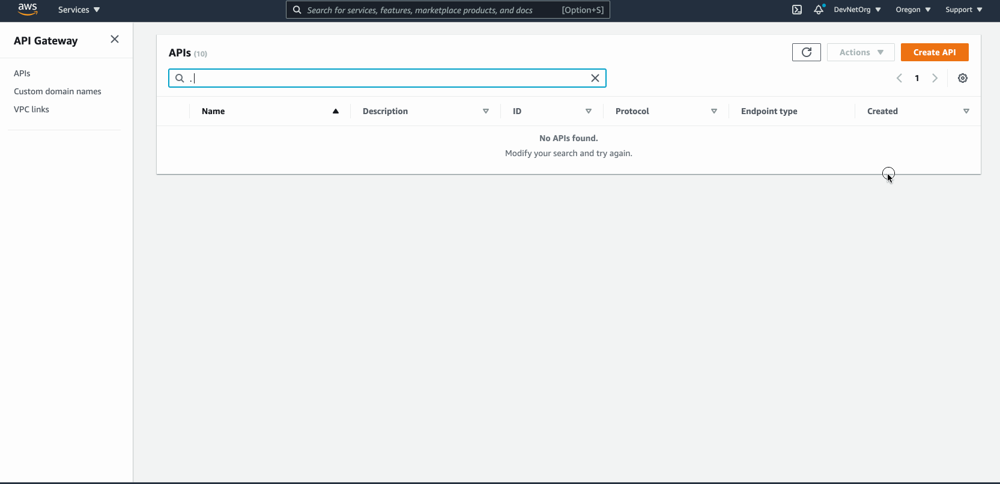
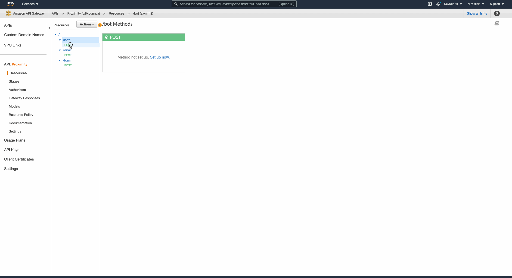
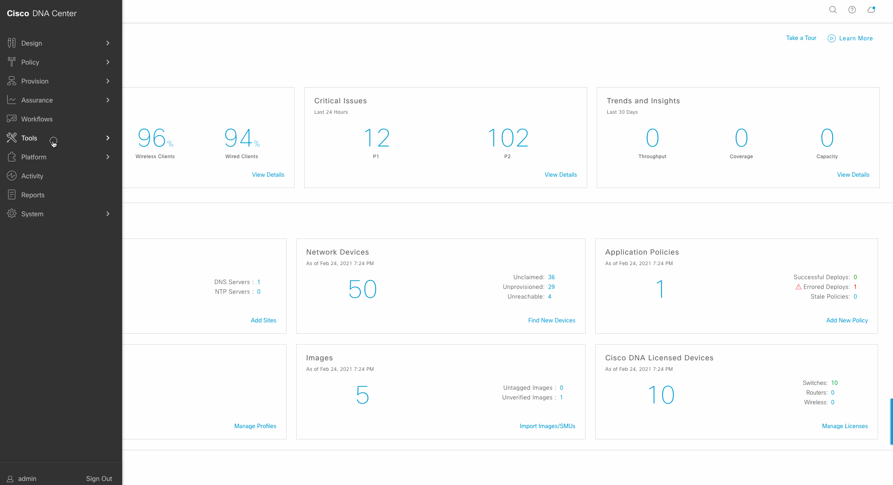

## Proximity App leveraging Cisco DNA Center APIs

As companies work to ensure the safety of their workforce returning to the physical office, leveraging current network infrastructure and APIs to aid with contact tracing will be paramount. 

We will leverage the new Cisco DNA Center Proximity API and Notification APIs with ChatOps to allow teams within a company to trace a pandemic positive employee, generate contact tracing report and respond quickly to keep their employees safe.

<a class="youtube-video" href="https://www.youtube.com/watch?v=KY6beOWgIV4" target="_blank" itemprop="youtube-video"></a>

## Application Architecture overview
Below is the overall architecture we will be putting together.


## Requirements
1. Have access to an instance of [Amazon Web Services](https://aws.amazon.com/marketplace/management/signin).
2. A [Webex](https://teams.webex.com/) Account
3. Access to [Cisco DNA Center](https://devnetsandbox.cisco.com/RM/Topology?c=14ec7ccf-2988-474e-a135-1e90b9bc6caf) with Release 2.1.2.x or above


## Getting Started
#### Step 1: Setup AWS - API Gateway
Before we start constructing our application we need to make sure we have all the dependencies configured and setup. 
Let's start by setting up our API gateway in AWS. We will leverage it as a receiver for all the [Webhooks](https://zapier.com/blog/what-are-webhooks/) leveraged in this app. 

⚠️ This portion of the application can also be implemented using [Flask](https://flask.palletsprojects.com/en/1.1.x/quickstart/) 

Setup **three** different API Endpoint:

1. Receive `Webex` messages webhook 
2. Receive `Webex` Adaptive Cards attachment webhook
3. Receive `DNA Center` Proximity Event webhook

**Setup** API Gateway





**Deploy** API to Stage:


Upon successfully creating your instance of **Proximity** API Gateway **from template** you will see three endpoints created:

1. `{{AWS-URI}}/bot` - This endpoint will be used as the `targetURL` for `messages` webhook in Webex
2. `{{AWS-URI}}/form` - This endpoint will be used as the `targetURL` for `attachment` webhook in Webex
3. `{{AWS-URI}}/dnac` - This endpoint will be leveraged to receive Cisco DNA Center proximity events

⚠️ We will use the above endpoints in our subsequent steps.


#### Step 2: Setup AWS - Lambda
Now that we've setup all the endpoints. Each endpoint will receive a webhook event and pass the data to a Lambda function to process it. 

ℹ️  [What is Lambda?](https://aws.amazon.com/lambda/features/)

let's build out our lambda functions and attach each to our API Gateway 

ℹ️  [How to deploy a Lambda function](https://docs.aws.amazon.com/codedeploy/latest/userguide/tutorial-lambda-sam.html)

###### 1. Bot `Messages` event Webhook handler:

Have a peek at the `lambda/bot-msgs` code folder, this is your first lambda function. Create it.

This Lambda function:

- Will capture the payload sent to `{{AWS-URI}}/bot` endpoint via Webex `Messages` Webhook.
- Parse the JSON payload in `bot_msg_handler()` python function. 
- Response to user with [Adaptive Card](https://developer.webex.com/docs/api/guides/cards) UI found in `card.json` to capture user input

Once deployed, link `/bot` `POST` Method to Lambda function `bot-msgs` in API Gateway





###### 2. Adaptive Cards `AttachmentActions` event Webhook handler:

The second webhook we need to handle is when user "Submits" the Form posted by our bot. 
This data needs to be passed to another Lambda function and parsed. have a peek at `/lambda/form-submit` code folder. Create it similarly to the step above.

This Lambda function:

 - Will capture the response from the Adaptive Cards form sent to `{{AWS-URI}}/form` endpoint via Webex `AttachmentActions` Webhook.
 - Parse the JSON payload in `post_response(form_data)` python function
 - Initiates an API Call to Cisco DNA Center and passes user entered values to `/client-proximity` in `client_proximity(client_username, days, resolution)`
 
Once deployed, link `/form` `POST` Method to Lambda function `form-submit` in API Gateway
 

###### 3. Cisco DNA Center `NETWORK-CLIENTS-3-506` event Webhook handler:

The final webhook we need to handle is the data coming back from Cisco DNA Center based on the parameter we passed.
This data will be passed to the same Lambda function as our form submission function. simply point API gateway resource 
`/dnac` to the Lambda function `form-submit`

⚠️ If you chose to render the Client Proximity Data from DNAC in a nicely formatted PDF file. use the provided code in `/Lambda/proximity-report`


#### Step 3: Setup Webex and Cisco DNA Center Event Webhooks 
Now that your infrastructure is in place. You will need to make sure you API Gateway is deployed to stage (see Step 1) and capture the URL to each endpoint.

###### 1. Webex Messaging and Attachment Actions Webhook Registration:

Create two different [webhooks](https://developer.webex.com/docs/api/v1/webhooks/create-a-webhook) under your bot's `Bearer Token` 
- Make a `POST` request to `/v1/webhooks`

⚠️ When creating your Webex Event Webhook make sure you are not using your **personal** API Token rather your **bot's** 

- For Messaging events your payload should look something like this, `targetUrl` here should be pointing to API Gateway endpoint created on `Step 1`:

```JSON
{
  "name": "My Messaging Webhook",
  "targetUrl": "https://{{API GATEWAY URL}}/bot",
  "resource": "messages",
  "event": "created"
}
```

- For Attachment Actions Event Webhook your body payload should look similar to this:

```JSON
{
  "name": "My Messaging Webhook",
  "targetUrl": "https://{{API GATEWAY URL}}/form",
  "resource": "attachmentActions",
  "event": "created"
}
```

###### 2. Cisco DNAC Center Event Webhook Registration:

- Create an `Event Destination` - This tells DNAC where to ship off the network events to, in this case to our final API gateway endpoint `/dnac`


 
- Create a subscription to the network event id `NETWORK-CLIENTS-3-506` which is the Client Proximity Webhook and assign the newly created destination 





## SUCCESS
You have successfully built an entire application around Cisco DNA Center's Client Proximity API. The one thing to note here is that this API endpoint is not only pandemic related but you can easily use it to cater for your VIP clients on your network and assure an always on connection for their devices. The combination of ChatOps and Network Programmability can be super useful and powerful! 
