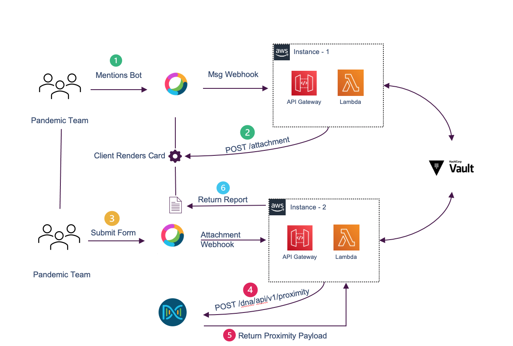

## Proximity App leveraging Cisco DNA Center APIs

As companies work to ensure the safety of their workforce returning to the physical office, leveraging current network infrastructure and APIs to aid with contact tracing will be paramount. 

We will leverage the new Cisco DNA Center Proximity API and Notification APIs with ChatOps to allow teams within a company to trace a pandemic positive employee, generate contact tracing report and respond quickly to keep their employees safe.

## Application Architecture overview
Below is the overall architecture we will be putting together.

## Requirements
1. Have access to an instance of [Amazon Web Services](https://aws.amazon.com/marketplace/management/signin).
2. A [Webex](https://teams.webex.com/) Account
3. Access to [Cisco DNA Center](https://devnetsandbox.cisco.com/RM/Topology?c=14ec7ccf-2988-474e-a135-1e90b9bc6caf) with Release 2.1.2.x or above

## Getting Started
#### Step 1: Setup AWS - API Gateway
Before we start constructing our application we need to make sure we have all the dependencies configured and setup. 
Let's start by setting up our API gateway in AWS. We will leverage it as a receiver for all the [Webhooks](https://zapier.com/blog/what-are-webhooks/) leveraged in this app. 

⚠️ This portion of the application can also be implemented using [Flask](https://flask.palletsprojects.com/en/1.1.x/quickstart/) 

Setup **three** different API Endpoint:

1. Receive `Webex` messages webhook 
2. Receive `Webex` Adaptive Cards attachment webhook
3. Receive `DNA Center` Proximity Event webhook

ℹ️ You can setup 3 different API Gateway `Resources` with a `POST` method described [here](https://docs.aws.amazon.com/apigateway/latest/developerguide/getting-started.html)

For your convenience I've exported an API Gateway swagger example which can be used as a template.

**Import** provided swagger file from `api-gateway` folder as shown below:

**Deploy** API to Stage:

Upon successfully creating your instance of **Proximity** API Gateway **from template** you will see three endpoints created:

1. `{{AWS-URI}}/bot/messages` - This endpoint will be used as the `targetURL` for `messages` webhook in Webex
2. `{{AWS-URI}}/form/submit` - This endpoint will be used as the `targetURL` for `attachment` webhook in Webex
3. `{{AWS-URI}}/dnac/client-proximity` - This endpoint will be leveraged to receive Cisco DNA Center proximity events

⚠️ We will use the above endpoints in our subsequent steps.

#### Step 2: Setup AWS - Lambda
Now that we've setup all the endpoints. Each endpoint will receive a webhook event and pass the data to a Lambda function to process it. 

 
 